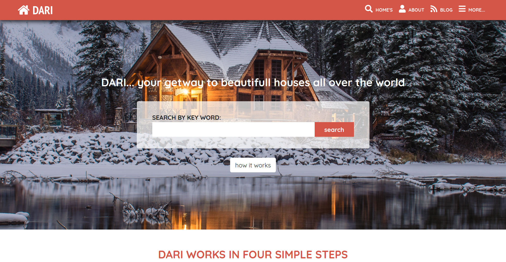
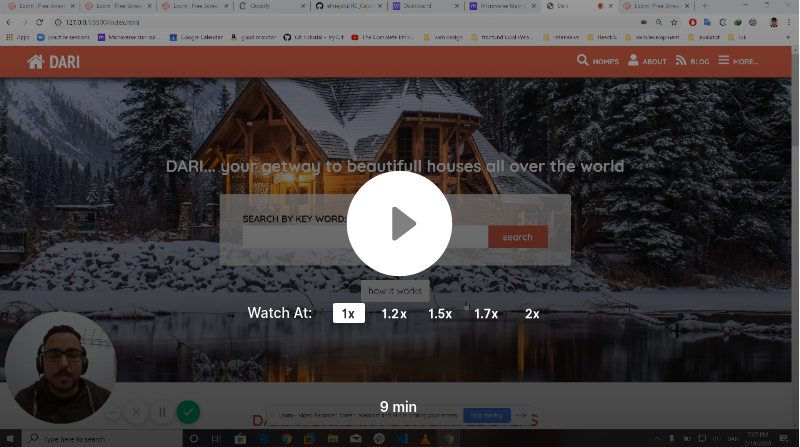

# Dari, Find your own house from all over the world.

> This website is about allowing users to find rents from all over the world, for now, it is just static but maybe in the future, I will make it dynamic who knows. This project consists of one search Page, a search result Page, and a details Page. I developed all of them on my own using HTML, CSS, and bootstrap. The site is responsive to laptop, tablet, and mobile resolutions. I added a small bit of JS to import a Google maps API on the details page to show where the location of the house to the users.

# Project Preview

# Project Presentation Video

## Built With

- HTML
- CSS
- JS
- Flexbox
- Gid system
- bootstrap

## Live Demo

[Live Demo Link](https://raw.githack.com/elmejdki/HC_Capstone_Project/create_darieverywhere_website/index.html)

### Prerequisites
To make this repository working in your local machine you need only a browser.

## Authors

👤 **Zakariae El Mejdki**

- Github: [@elmejdki](https://github.com/elmejdki)
- Twitter: [@zakariae_elmejdki](https://twitter.com/zakariaemejdki)
- Linkedin: [zakariae elmejdki](https://www.linkedin.com/in/zakariaeelmejdki/)

## 🤝 Contributing

Contributions, issues and feature requests are welcome.

Feel free to check the [issues page](https://github.com/elmejdki/HC_Capstone_Project/issues).

## Credits

Thanks to [Mathew Njuguna and others on Behance](https://www.behance.net/mathewnjuguna) for her awesome design work. I based my work on  [this](https://www.behance.net/gallery/25563385/PatashuleKE) design.

## Show your support

Give a ⭐️ if you like this project!

## License

This project is [MIT](lic.url) licensed.
